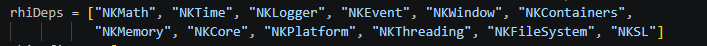

Avant les conditions 12 dépendances de bases avant toutes les dépendances

Nous avons 4 conditinos sur les dépendances. Si j'ai bien compris elle portent surtout sur les API Vulkan ou OpenGl à utiliser
if WANT_VULKAN, if USE_NKGLAD, if USE_NKGLSLANG, if USE_NKSPIRVCROSS

les defines posées initialement sans conditions sont 2 NKRENDERER_USE_NKGLAD et NKENTSEU_ENABLE_VULKAN_BACKEND

Ensuite on a la possiblité d'ajouter jusqu'à 5 autre defines

ceux qui dépendent de la machine NK_RHI_GLSLANG_ENABLED", "ENABLE_HLSL", NKRENDERER_USE_NKGLAD, NK_RHI_SPIRVCROSS_ENABLED
